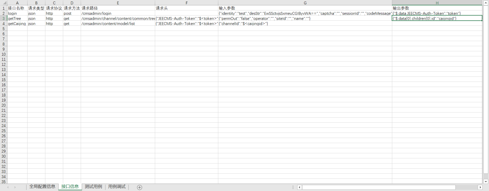
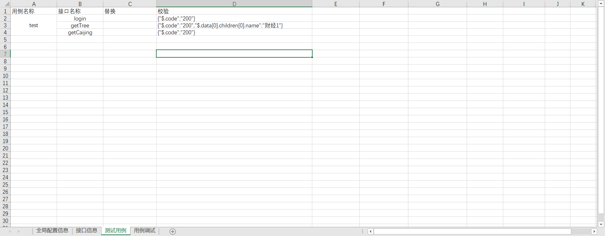
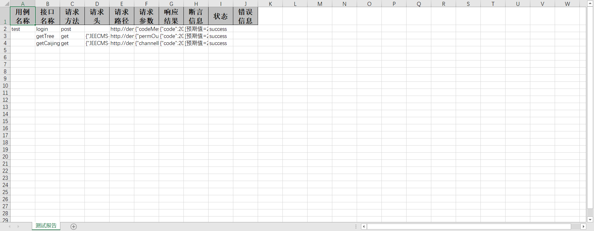
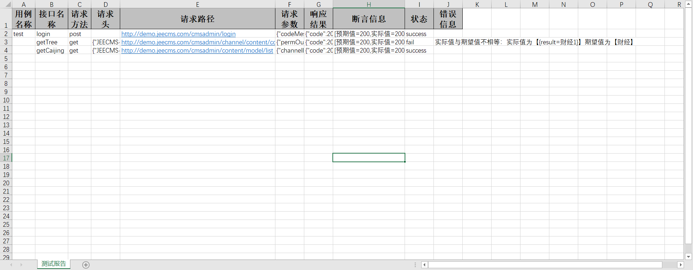

#autotest

### 项目介绍:结合多年自动化测试工作经验，多个公司的自动化测试平台的解决方案，使用java+excel开发一套兼容接口、WebUI、安卓和ios的自动化测试框架。

## 1.设计思路

### 1.1接口自动化

#### 1.全局配置信息:

+ 配置环境信息，以及数据库信息。

#### 2.接口信息:

+ 接口名称：唯一，用来关联测试用例，一个接口只要录制一次。
+ 请求类型：json/xml/html/binary/form-data/form-urlencoded
+ 请求协议：http/https/web-socket
+ 请求方法：get/post/put/delete
+ 请求路径：域名后面的路径，比如：https://www.google.com/search 就填/search
+ 请求头：使用json格式
+ 输入参数：使用json格式，接口的入参，可以使用前面的输出变量，格式$<变量名称>
+ 输出参数：使用json格式，接口的出参，key为接口的响应值的path，采用jsonpath语法。value为变量名称

#### 3.测试用例：

+ 用例名称：合并单元格，合并有几个就是用例包含几个接口，为一个完整的测试用例执行单元
+ 接口名称：关联上面的接口名称
+ 替换：使用json格式、jsonpath语法，替换输入参数，主要解决同一个接口不同的参数。
+ 校验：使用json格式、jsonpath语法，做测试用例的断言、尽可能的写细。

#### 4.测试报告：
 

### 1.2WebUI自动化
